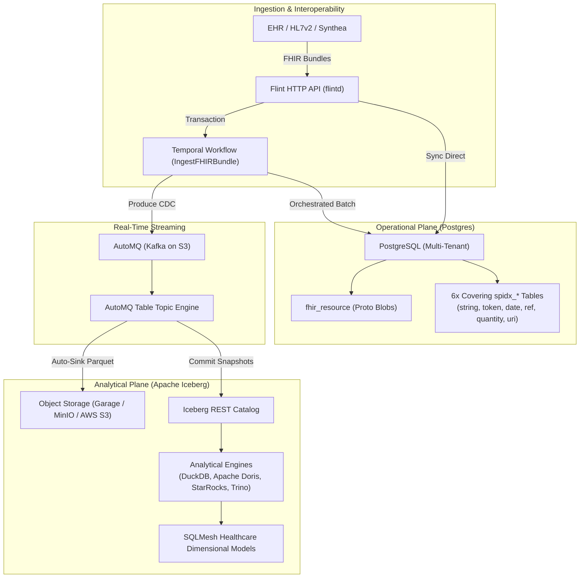
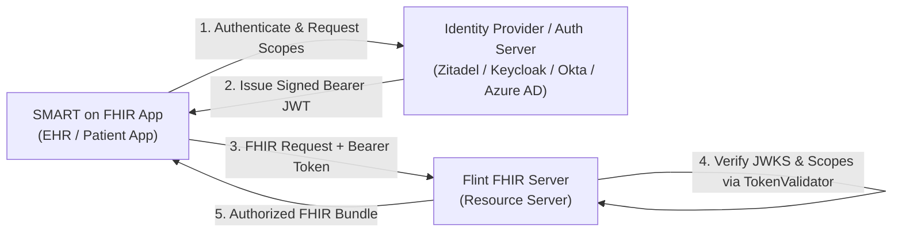

# Flint — High-Performance FHIR R4 Server on a Data Lakehouse

[](https://github.com/flint-fhir/flint/actions/workflows/ci.yml)
[](go.mod)
[](https://hl7.org/fhir/R4/)
[](LICENSE)
[](CODE_OF_CONDUCT.md)

**Flint** is an open-source, cloud-agnostic **FHIR R4 server** and **real-time clinical data lakehouse** engine. It combines high-throughput transactional EHR ingestion with instant analytical querying on **Apache Iceberg**, bridging the operational-analytical divide in healthcare data infrastructure.

All domain models, search index extractors, and storage structures are compiled directly from `google/fhir` Protocol Buffers using [proto2type](https://github.com/protocgen/proto2type).

---

## Why Flint?

Traditional FHIR servers (e.g. HAPI FHIR, Medplum) are optimized for transactional EHR exchange but create massive architectural bottlenecks when analytics, population health, and machine learning are needed:

| Dimension | Traditional FHIR Servers | Flint |
|:----------|:-------------------------|:------|
| **Data Format** | Heavy JSON / relational table sprawl | Compact Protocol Buffers (**16× wire reduction**, 124B vs ~2KB) |
| **Search Indexing** | Deep relational joins or Elasticsearch sync | **6 static covering index tables** per tenant (HAPI pattern), sub-10ms queries |
| **Analytics (OLAP)** | Nightly batch ETL / Flink JVM pipelines | **Zero-copy streaming CDC** to **Apache Iceberg** via AutoMQ Table Topics |
| **Schema Maintenance** | Manual migrations across hundreds of FHIR types | **100% generated** via `proto2type` from official HL7 SearchParameter JSON |
| **Multi-Tenancy** | Soft tenancy (`tenant_id` column filters) | **Schema-per-tenant physical isolation** for HIPAA compliance |
| **Throughput** | Bottlenecked by JVM garbage collection | **>1,400 resources/sec** transactional store, **>1,000 resources/sec** HTTP |

---

## Architecture



---

## Verified Benchmarks

Flint includes a dedicated benchmarking harness ([`cmd/loadtest`](cmd/loadtest/)) to measure ingestion throughput, database scaling, and latency percentiles on local and cloud environments:

* **Direct Postgres Store Ingestion**: **1,410+ resources/sec** (282+ bundles/sec) sustained with transactional ACID upserts and index extraction across Big 5 resources.
* **HTTP REST API Transaction Bundles**: **1,024+ resources/sec** (205+ bundles/sec) sustained with 100 concurrent workers and **100% 2xx success rate**.
* **AutoMQ Restart Recovery**: **Zero data loss** validated across broker container crash/restart with automatic offset resumption in Apache Iceberg.
* **Latency Profile**:
  * $p50 < 250\text{ms}$
  * $p90 < 360\text{ms}$
  * $p99 < 500\text{ms}$

---

## Supported FHIR Resources (Big 5)

Flint implements full search index extraction and transactional persistence for the Core Big 5 healthcare resources:

| Resource Type | Search Index Extraction | Covering Tables | Status |
|:--------------|:------------------------|:----------------|:-------|
| **`Patient`** | `name`, `identifier`, `birthdate`, `gender`, `active`, `address-postalcode` | `spidx_string`, `spidx_token`, `spidx_date` | ✅ Production Ready |
| **`Condition`** | `code`, `clinical-status`, `verification-status`, `patient`, `onset-date` | `spidx_token`, `spidx_reference`, `spidx_date` | ✅ Production Ready |
| **`Encounter`** | `status`, `class`, `type`, `subject`, `date` | `spidx_token`, `spidx_reference`, `spidx_date` | ✅ Production Ready |
| **`Observation`** | `status`, `category`, `code`, `subject`, `date`, `value-quantity`, `value-concept` | `spidx_token`, `spidx_reference`, `spidx_quantity`, `spidx_date` | ✅ Production Ready |
| **`Practitioner`** | `name`, `identifier`, `telecom`, `active` | `spidx_string`, `spidx_token` | ✅ Production Ready |

---

## Quickstart

### 1. Development Environment (Hermetic Nix Shell)

Flint provides a hermetic development environment with Nix and direnv:

```bash
# Clone the repository
git clone https://github.com/flint-fhir/flint.git
cd flint

# Allow direnv (or run nix develop)
direnv allow
```

### 2. Launch Local Dev Stack (k3d)

Spin up the local containerized stack (Postgres, Temporal, AutoMQ StatefulSet, Garage S3, Iceberg REST catalog):

```bash
task dev
```

Inspect service endpoints:
* **Flint Postgres**: `localhost:5432`
* **Temporal UI**: [http://localhost:8088](http://localhost:8088)
* **AutoMQ (Kafka)**: `localhost:9092`
* **Garage S3 Console**: [http://localhost:9001](http://localhost:9001)
* **Iceberg REST Catalog**: [http://localhost:8181](http://localhost:8181)

### 3. Build & Run Flint

```bash
# Build flintd, worker, and loadtest binaries
task build

# Run the Flint FHIR REST server
task run

# (In another terminal) Run the Temporal ingestion worker
task run-worker
```

### 4. Run Benchmarks & Tests

```bash
# Run unit and integration tests
task test

# Run high-throughput HTTP load test
task bench-http

# Run direct Postgres store load test
task bench-store

# Run AutoMQ Table Topic restart recovery test
task test-recovery
```

### 5. Query Analytical Iceberg Table with DuckDB

Query the Iceberg lakehouse table populated by AutoMQ Table Topic:

```bash
uv run --with duckdb --with "pyiceberg[s3fs]" --with pyarrow cmd/e2e/query_duckdb.py
```

Output:
```
=== DuckDB SQL Query on Iceberg Table ===
       patient_id  partition  offset                                                               raw_json
e2e-recovery-post          3       0 {"gender":{"value":"male"},"id":{"value":"e2e-recovery-post"},"name":[...]}
 e2e-recovery-pre          0       0 {"gender":{"value":"male"},"id":{"value":"e2e-recovery-pre"},"name":[...]}
      e2e-wf-001          5       1 {"gender":{"value":"female"},"id":{"value":"e2e-wf-001"},"name":[{"family":"Wonderland"...}]}
      e2e-wf-002          3       0 {"gender":{"value":"male"},"id":{"value":"e2e-wf-002"},"name":[...]}
      e2e-wf-003          2       1 [tombstone]
```

---

## API Reference

Flint implements standard FHIR R4 REST API interactions:

### Batch / Transaction Bundles
```http
POST /fhir/r4/{tenant}
Content-Type: application/fhir+json

{
  "resourceType": "Bundle",
  "type": "transaction",
  "entry": [
    {
      "resource": {
        "resourceType": "Patient",
        "id": "pat-123",
        "name": [{"family": "Smith", "given": ["Jane"]}],
        "gender": "female"
      },
      "request": { "method": "PUT", "url": "Patient/pat-123" }
    }
  ]
}
```

### Resource Interactions
* **Point Read**: `GET /fhir/r4/{tenant}/{resourceType}/{id}`
* **Create**: `POST /fhir/r4/{tenant}/{resourceType}`
* **Search**: `GET /fhir/r4/{tenant}/{resourceType}?{searchParams}&_count=20&_offset=0`
* **CapabilityStatement**: `GET /fhir/r4/{tenant}/metadata`
* **SMART Discovery**: `GET /fhir/r4/{tenant}/.well-known/smart-configuration`

### Advanced FHIR Search Engine
Flint implements high-performance relational search against the covering `spidx_*` index tables:
* **Date Range Queries**: Supports FHIR prefix comparators (`eq`, `ne`, `lt`, `le`, `gt`, `ge`, `sa`, `eb`, `ap`) over `spidx_date` timestamps:
  ```http
  GET /fhir/r4/tenant-a/Patient?birthdate=ge1980-01-01
  ```
* **Quantity Queries**: Supports comparator prefixes (`gt`, `lt`, `ge`, `le`, `eq`), systems, and units over `spidx_quantity`:
  ```http
  GET /fhir/r4/tenant-a/Observation?value-quantity=gt70|http://unitsofmeasure.org|kg
  ```
* **Include & Reverse Include**: Resolves target/source references across tables with bundle `"search": {"mode": "match" | "include"}` annotations:
  ```http
  GET /fhir/r4/tenant-a/Observation?code=29463-7&_include=Observation:patient
  GET /fhir/r4/tenant-a/Patient?family=smith&_revinclude=Observation:patient
  ```
* **Chained Searches**: Joins reference indexes with target parameter tables:
  ```http
  GET /fhir/r4/tenant-a/Observation?patient.name=smith
  ```

---

## SMART on FHIR v2 & Identity Architecture

Flint functions strictly as a high-performance **FHIR Resource Server (RS)**, delegating user authentication, password hashing, and login UI to OpenID Connect (OIDC) Identity Providers.



### Decoupled `TokenValidator` Interface (`pkg/auth`)
Flint protects endpoints through a pluggable interface:
* **`OIDCValidator`**: Standard OIDC and JWKS caching with RS256/ES256 verification (compatible with Okta, Azure AD, Keycloak, Auth0).
* **`ZitadelValidator`**: Specialized decorator mapping Zitadel organization domains to Flint tenant schemas, user metadata to patient IDs, and project roles to clinical SMART scopes.
* **`MockTokenValidator`**: In-memory RSA keypair signer and validator enabling sub-millisecond, zero-dependency unit tests.

### Security Guarantees
1. **SMART v1 & v2 Scopes**: Granular action enforcement (`c`, `r`, `u`, `d`, `s`) across patient, user, and system tiers.
2. **Tenant Boundary Enforcement**: Rejects cross-tenant token access with HTTP 403.
3. **Patient Compartment Isolation**: When a token carries a `patient_id` launch claim:
   * Reading records of another patient returns `403 Forbidden`.
   * Queries with mismatched `patient` or `subject` parameters return `403 Forbidden`.

### Environment Configuration
```bash
# Enable SMART on FHIR with Zitadel
FLINT_OIDC_ISSUER="https://auth.azra.dev"
FLINT_OIDC_AUDIENCE="flint-api"
FLINT_AUTH_PROVIDER="zitadel"
FLINT_ZITADEL_TENANT_FROM_DOMAIN="true"
FLINT_SMART_AUTH_URL="https://auth.azra.dev/oauth/v2/authorize"
FLINT_SMART_TOKEN_URL="https://auth.azra.dev/oauth/v2/token"
```

---

## Property-Based Testing (via Hegel)

Flint leverages [Hegel](https://hegel.dev) (`hegel.dev/go/hegel`) for type-driven, generative property-based testing. Instead of checking only human-authored table cases, Hegel draws inputs across formal grammars and shrinks failures to minimal counterexamples:

* **Scope Grammar Invariance**: Validates that all strings matching the formal SMART v1/v2 grammar parse deterministically.
* **Query Filter Invariance**: Asserts that fine-grained query filters (`?category=vital-signs`) never alter base resource permissions.
* **Search Parameter Invariance**: Verifies parser prefix and grammar preservation across generated ISO date formats, decimal quantities, units, and `_include`/`_revinclude` strings.
* **No-Panic Invariance**: Fuzzes parsers with arbitrary inputs and unicode sequences to guarantee zero crashes or hangs.

---

## Project Structure

```
flint/
├── automq/               # Franz-go Kafka producer with CDC headers
├── bin/                  # Compiled binaries (flintd, worker, loadtest)
├── cmd/
│   ├── flintd/           # FHIR REST HTTP server entrypoint
│   ├── worker/           # Temporal ingestion worker entrypoint
│   ├── loadtest/         # High-throughput load testing harness
│   └── e2e/              # End-to-end integration & restart recovery tests
├── deploy/
│   ├── k3d/              # Local k3d cluster configuration
│   └── k8s/              # Kubernetes manifests (Postgres, Temporal, AutoMQ StatefulSet, Iceberg)
├── fhir/r4/              # Machine-readable HL7 FHIR R4 SearchParameter definitions
├── gen/go/
│   ├── flint/auth/v1/    # Protobuf-generated security context and discovery types
│   └── store/postgres/   # proto2type generated search index extractors
├── ingest/
│   ├── activity/         # Temporal activities (WritePostgresBatch, AutoMQ CDC)
│   └── workflow/         # Temporal IngestFHIRBundle workflow
├── pkg/
│   ├── auth/             # TokenValidator, OIDC/Zitadel, and Hegel property tests
│   └── fhirutil/         # Protobuf nil-safe accessors & helpers
├── proto/
│   ├── flint/auth/v1/    # Canonical Protobuf schemas for auth & security context
│   └── google/fhir/      # Vendored google/fhir R4 protocol buffers
├── server/               # stdlib HTTP router, Bundle engine, SMART discovery, auth middleware
├── store/postgres/       # Operational store, DDL migrations, spidx_* tables
├── flake.nix             # Hermetic Nix development environment
├── lefthook.yml          # Git pre-commit & pre-push hooks
└── Taskfile.yaml         # Project workflow automation tasks
```

---

## Community & Contributing

We welcome contributions! Please see our:
* [Code of Conduct](CODE_OF_CONDUCT.md)
* [Contributing Guide](CONTRIBUTING.md)
* [Security Policy](SECURITY.md)

---

## License

Flint is licensed under the [Apache License 2.0](LICENSE).
