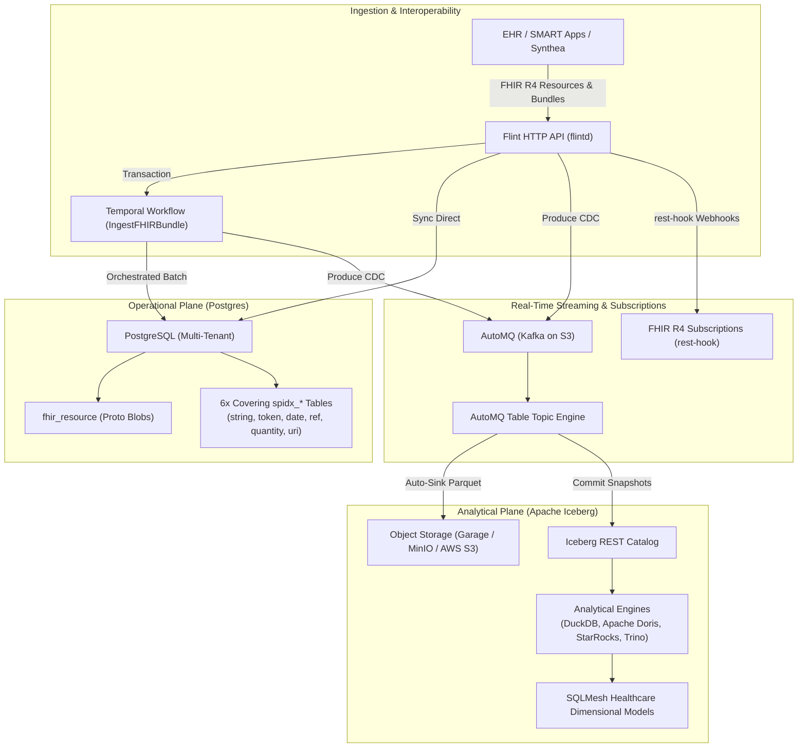

# Flint — High-Performance FHIR R4 Server on a Data Lakehouse

[](https://github.com/flint-fhir/flint/actions/workflows/ci.yml)
[](go.mod)
[](https://hl7.org/fhir/R4/)
[](LICENSE)
[](CODE_OF_CONDUCT.md)

**Flint** is an open-source, cloud-agnostic **FHIR R4 server** and **real-time clinical data lakehouse** engine. It combines high-throughput transactional EHR ingestion with instant analytical querying on **Apache Iceberg**, bridging the operational-analytical divide in healthcare data infrastructure.

All domain models, search index extractors, and storage structures are compiled directly from `google/fhir` Protocol Buffers using [proto2type](https://github.com/protocgen/proto2type).

---

## Why Flint?

Traditional FHIR servers (e.g. HAPI FHIR, Medplum) are optimized for transactional EHR exchange but create massive architectural bottlenecks when analytics, population health, and machine learning are needed:

| Dimension | Traditional FHIR Servers | Flint |
|:----------|:-------------------------|:------|
| **Data Format** | Heavy JSON / relational table sprawl | Compact Protocol Buffers (**16× wire reduction**, 124B vs ~2KB) |
| **Search Indexing** | Deep relational joins or Elasticsearch sync | **6 static covering index tables** per tenant (HAPI pattern), sub-10ms queries |
| **Analytics (OLAP)** | Nightly batch ETL / Flink JVM pipelines | **Zero-copy streaming CDC** to **Apache Iceberg** via AutoMQ Table Topics |
| **Schema Maintenance** | Manual migrations across hundreds of FHIR types | **100% generated** via `proto2type` from official HL7 SearchParameter JSON |
| **Multi-Tenancy** | Soft tenancy (`tenant_id` column filters) | **Schema-per-tenant physical isolation** for HIPAA compliance |
| **Throughput** | Bottlenecked by JVM garbage collection | **>1,400 resources/sec** transactional store, **>1,000 resources/sec** HTTP |

---

## Architecture


```mermaid
flowchart TD
    subgraph Ingestion ["Ingestion & Interoperability"]
        EHR["EHR / SMART Apps / Synthea"] -->|FHIR R4 Resources & Bundles| API["Flint HTTP API (flintd)"]
        API -->|Transaction| Temporal["Temporal Workflow (IngestFHIRBundle)"]
    end

    subgraph OLTP ["Operational Plane (Postgres)"]
        API -->|Sync Direct| PG["PostgreSQL (Multi-Tenant)"]
        Temporal -->|Orchestrated Batch| PG
        PG --> RProto["fhir_resource (Proto Blobs)"]
        PG --> Spidx["6x Covering spidx_* Tables\n(string, token, date, ref, quantity, uri)"]
    end

    subgraph Streaming ["Real-Time Streaming & Subscriptions"]
        API -->|Produce CDC| AMQ["AutoMQ (Kafka on S3)"]
        Temporal -->|Produce CDC| AMQ
        AMQ --> TT["AutoMQ Table Topic Engine"]
        API -->|rest-hook Webhooks| Sub["FHIR R4 Subscriptions (rest-hook)"]
    end

    subgraph Lakehouse ["Analytical Plane (Apache Iceberg)"]
        TT -->|Auto-Sink Parquet| S3["Object Storage (Garage / MinIO / AWS S3)"]
        TT -->|Commit Snapshots| Catalog["Iceberg REST Catalog"]
        Catalog --> Query["Analytical Engines\n(DuckDB, Apache Doris, StarRocks, Trino)"]
        Query --> Models["SQLMesh Healthcare Dimensional Models"]
    end
```

---

## Verified Benchmarks

Flint includes a dedicated benchmarking harness ([`cmd/loadtest`](cmd/loadtest/)) to measure ingestion throughput, database scaling, and latency percentiles on local and cloud environments:

* **Direct Postgres Store Ingestion**: **1,410+ resources/sec** (282+ bundles/sec) sustained with transactional ACID upserts and index extraction across Big 5 resources.
* **HTTP REST API Transaction Bundles**: **1,024+ resources/sec** (205+ bundles/sec) sustained with 100 concurrent workers and **100% 2xx success rate**.
* **AutoMQ Restart Recovery**: **Zero data loss** validated across broker container crash/restart with automatic offset resumption in Apache Iceberg.
* **Latency Profile**:
  * $p50 < 250\text{ms}$
  * $p90 < 360\text{ms}$
  * $p99 < 500\text{ms}$

---

## Supported FHIR Resources (All 146 FHIR R4 Types & 26 US Core v6.1.0 / v7.0.0 Profiles) & Conformance Matrix

Flint implements full search index extraction, transactional persistence, SMART on FHIR v2 compartment isolation, granular sub-resource scopes (`?category=`) & **Backend Services asymmetric `private_key_jwt` (`RS256`/`RS384`/`ES384`, RFC 7523)**, **RFC 6902 JSON Patch / RFC 7396 Merge Patch**, **Conditional Create/Update/Delete**, **`Patient/$everything` & `Patient/{id}/$summary` (HL7 IPS)**, **`Composition/{id}/$document`**, **`Questionnaire/$populate` & `QuestionnaireResponse/$extract` (HL7 Da Vinci SDC)**, **`Patient/$match` (MPI) & `Patient/$member-match` (Da Vinci HRex/PDex)**, **`Claim/$submit` (Da Vinci PAS)**, **Composite Search (`code-value-quantity`, `component-code-value-quantity`, `combo-code-value-quantity`), `_list` Cohort Search & Enhanced Forward Chaining (`:exact`, `:not`, reference)**, **`$meta` / `$meta-add` / `$meta-delete`**, **Clinical Quality Measures (`Measure/$evaluate-measure` — CMS165 / CMS122 eCQM)**, **HL7 CDS Hooks v2.0 (`/cds-services`)**, **Terminology Services (`$expand`, `$validate-code`, `$lookup`, `ConceptMap/$translate`)**, **`Subscription` (`rest-hook`)**, and **Proto-compiled OpenAPI 3.1.0 schemas** (`protoreflect.MessageDescriptor` → OpenAPI 3.1 JSON Schema) across **all 146 FHIR R4 resource types** and **all 26 US Core v6.1.0 / v7.0.0 (USCDI v3 & v4) profiles**:

| Resource / Operation | US Core v6.1.0 / v7.0.0 / ONC `(g)(10)` Profile | Interactions | Search Parameters (`spidx_*`) | SMART v2 Scopes | Status |
|:---------------------|:------------------------------------------------|:-------------|:------------------------------|:----------------|:-------|
| **`Patient`** | US Core Patient (`v6.1.0` & `v7.0.0`), HL7 IPS (`$summary`), MPI (`$match`), Da Vinci HRex (`$member-match`) | `read`, `vread`, `update`, `patch`, `delete`, `history-instance`, `history-type`, `create`, `search-type`, `compartment-search`, `conditional-create/update/delete`, `$everything`, `$summary`, `$match`, `$member-match`, `$meta`, `$meta-add`, `$meta-delete`, `$export`, `$validate` | `_id`, `_lastUpdated`, `identifier`, `name`, `family`, `given`, `birthdate`, `gender`, `active`, `address-city`, `address-state`, `address-postalcode`, `organization`, `_has`, `_list`, `_revinclude` | `patient/Patient.rs`, `user/Patient.cruds`, `system/Patient.rs` | ✅ Production Ready |
| **`Encounter`** | US Core Encounter (`v6.1.0` & `v7.0.0`) | `read`, `vread`, `update`, `patch`, `delete`, `history-instance`, `history-type`, `create`, `search-type`, `conditional-create/update/delete`, `$validate` | `_id`, `_lastUpdated`, `identifier`, `date`, `patient`, `subject`, `status`, `class`, `type`, `location`, `_include` | `patient/Encounter.rs`, `user/Encounter.cruds`, `system/Encounter.rs` | ✅ Production Ready |
| **`Condition`** | US Core Condition Problems/Health Concerns & Encounter Diagnosis (`v6.1.0` & `v7.0.0`) | `read`, `vread`, `update`, `patch`, `delete`, `history-instance`, `history-type`, `create`, `search-type`, `conditional-create/update/delete`, `$validate` | `_id`, `_lastUpdated`, `patient`, `subject`, `code`, `clinical-status`, `verification-status`, `category`, `onset-date`, `recorded-date`, `encounter`, `_include` | `patient/Condition.rs`, `user/Condition.cruds`, `system/Condition.rs` | ✅ Production Ready |
| **`Observation`** | US Core Vital Signs, Lab, Blood Pressure, Avg BP, Care/Treatment Preference, Simple & Screening (`v6.1.0` & `v7.0.0`) | `read`, `vread`, `update`, `patch`, `delete`, `history-instance`, `history-type`, `create`, `search-type`, `conditional-create/update/delete`, `$validate` | `_id`, `_lastUpdated`, `patient`, `subject`, `code`, `category`, `status`, `date`, `value-quantity`, `component-code`, `combo-code`, `component-value-quantity`, `combo-value-quantity`, `code-value-quantity`, `component-code-value-quantity`, `combo-code-value-quantity`, `_include` | `patient/Observation.rs` (incl. `?category=`), `user/Observation.cruds`, `system/Observation.rs` | ✅ Production Ready |
| **`MedicationRequest`** | US Core MedicationRequest (`v6.1.0` & `v7.0.0`) | `read`, `vread`, `update`, `patch`, `delete`, `history-instance`, `history-type`, `create`, `search-type`, `conditional-create/update/delete`, `$validate` | `_id`, `_lastUpdated`, `patient`, `subject`, `status`, `intent`, `code`, `authoredon`, `encounter`, `requester`, `medication`, `_include` | `patient/MedicationRequest.rs`, `user/MedicationRequest.cruds`, `system/MedicationRequest.rs` | ✅ Production Ready |
| **`AllergyIntolerance`** | US Core AllergyIntolerance (`v6.1.0` & `v7.0.0`) | `read`, `vread`, `update`, `patch`, `delete`, `history-instance`, `history-type`, `create`, `search-type`, `conditional-create/update/delete`, `$validate` | `_id`, `_lastUpdated`, `patient`, `subject`, `clinical-status`, `verification-status`, `code`, `criticality`, `date`, `_include` | `patient/AllergyIntolerance.rs`, `user/AllergyIntolerance.cruds`, `system/AllergyIntolerance.rs` | ✅ Production Ready |
| **`Procedure`** | US Core Procedure (`v6.1.0` & `v7.0.0`) | `read`, `vread`, `update`, `patch`, `delete`, `history-instance`, `history-type`, `create`, `search-type`, `conditional-create/update/delete`, `$validate` | `_id`, `_lastUpdated`, `patient`, `subject`, `status`, `code`, `date`, `encounter`, `performer`, `_include` | `patient/Procedure.rs`, `user/Procedure.cruds`, `system/Procedure.rs` | ✅ Production Ready |
| **`DiagnosticReport`** | US Core DiagnosticReport Lab & Note (`v6.1.0` & `v7.0.0`) | `read`, `vread`, `update`, `patch`, `delete`, `history-instance`, `history-type`, `create`, `search-type`, `conditional-create/update/delete`, `$validate` | `_id`, `_lastUpdated`, `patient`, `subject`, `status`, `category`, `code`, `date`, `issued`, `result`, `_include` | `patient/DiagnosticReport.rs`, `user/DiagnosticReport.cruds`, `system/DiagnosticReport.rs` | ✅ Production Ready |
| **`Immunization`** | US Core Immunization (`v6.1.0` & `v7.0.0`) | `read`, `vread`, `update`, `patch`, `delete`, `history-instance`, `history-type`, `create`, `search-type`, `conditional-create/update/delete`, `$validate` | `_id`, `_lastUpdated`, `patient`, `subject`, `status`, `vaccine-code`, `date`, `lot-number`, `_include` | `patient/Immunization.rs`, `user/Immunization.cruds`, `system/Immunization.rs` | ✅ Production Ready |
| **`Specimen` & `Location`** | US Core Specimen & Location (`v7.0.0` / USCDI v4) | Full CRUD, `patch`, `vread`, `_history`, `search-type`, `conditional-*`, `$validate` | `_id`, `_lastUpdated`, `identifier`, `patient`, `subject`, `type`, `status`, `bodysite`, `collected`, `name`, `address`, `address-city`, `address-state`, `address-postalcode`, `organization` | `patient/Specimen.rs`, `user/Location.rs`, `system/*.rs` | ✅ Production Ready |
| **`DocumentReference` & `Provenance`** | US Core DocumentReference & Provenance (`v6.1.0` & `v7.0.0`) | Full CRUD, `patch`, `vread`, `_history`, `search-type`, `conditional-*`, `$validate` | `_id`, `_lastUpdated`, `identifier`, `patient`, `subject`, `status`, `type`, `category`, `date`, `period`, `author`, `target`, `agent`, `recorded`, `_revinclude` | `patient/DocumentReference.rs`, `patient/Provenance.rs`, `system/*.rs` | ✅ Production Ready |
| **Care Coordination & Coverage (`CarePlan`, `CareTeam`, `Goal`, `ServiceRequest`, `Coverage`, `QuestionnaireResponse`, `MedicationDispense`, `Medication`, `Device`, `Practitioner`, `PractitionerRole`, `Organization`, `RelatedPerson`)** | US Core `v6.1.0` & `v7.0.0` | Full CRUD, `patch`, `vread`, `_history`, `search-type`, `conditional-*`, `$validate` | `_id`, `_lastUpdated`, `identifier`, `patient`, `subject`, `status`, `category`, `code`, `date`, `intent`, `lifecycle-status`, `target-date`, `authored`, `questionnaire`, `whenhandedover`, `type`, `udi-di`, `practitioner`, `organization`, `specialty`, `role`, `name`, `address-*` | `patient/*.rs`, `user/*.cruds`, `system/*.rs` | ✅ Production Ready |
| **All 146 FHIR R4 Resource Types** | HL7 FHIR R4.0.1 Base Specification | Full CRUD, `patch`, `vread`, `_history`, `search-type`, `conditional-*`, `$meta`, `$meta-add`, `$meta-delete`, `$validate`, OpenAPI 3.1 | Dynamic `protoreflect` index extraction across `spidx_string`, `spidx_token`, `spidx_date`, `spidx_reference`, `spidx_quantity`, `spidx_uri` | `patient/*.rs`, `user/*.cruds`, `system/*.rs` | ✅ Production Ready |
| **`Questionnaire`, `QuestionnaireResponse` & `Composition` (HL7 SDC & Document)** | HL7 Da Vinci DTR / Structured Data Capture (SDC) & Clinical Document Assembly | `GET/POST /Questionnaire/$populate`, `/Questionnaire/{id}/$populate`, `POST /QuestionnaireResponse/$extract`, `/QuestionnaireResponse/{id}/$extract`, `GET/POST /Composition/{id}/$document` | `subject`, `identifier`, `persist` | `user/Questionnaire.rs`, `user/QuestionnaireResponse.cruds`, `patient/*.rs` | ✅ Production Ready |
| **`Claim` & `Claim/$submit` (Da Vinci PAS)** | HL7 Da Vinci Prior Authorization Support (PAS) & FHIR R4 Financial | `POST /Claim/$submit` (accepts `Claim`, `Bundle`, or `Parameters`; persists & returns adjudicated `ClaimResponse` with `preAuthRef`) | `_id`, `patient`, `provider`, `status`, `use`, `created` | `user/Claim.cruds`, `system/Claim.cruds`, `patient/Claim.rs` | ✅ Production Ready |
| **`Measure` & `$evaluate-measure` (eCQM)** | HL7 FHIR R4 Clinical Quality Measures / CMS eCQM (`CMS165`, `CMS122`) | `GET/POST /Measure/$evaluate-measure`, `/Measure/{id}/$evaluate-measure` (`MeasureReport` `individual` & `summary`) | `measure`, `periodStart`, `periodEnd`, `subject`, `reportType` | `user/Measure.rs`, `system/Measure.rs`, `patient/*.rs` | ✅ Production Ready |
| **HL7 CDS Hooks v2.0 (`/cds-services`)** | HL7 CDS Hooks v2.0 Clinical Decision Support (`patient-view`, `order-select`) | `GET /cds-services`, `POST /cds-services/{serviceId}` (auto-hydrating FHIR prefetch + actionable Cards/Suggestions) | `flint-hypertension-care-gap`, `flint-diabetes-a1c-care-gap`, `flint-medication-allergy-check` | Public Discovery / SMART Bearer Token | ✅ Production Ready |
| **Terminology (`ValueSet`, `CodeSystem`, `ConceptMap`)** | HL7 FHIR R4 Terminology Services & US Core ValueSets | `GET/POST ValueSet/$expand`, `ValueSet/{id}/$expand`, `ValueSet/$validate-code`, `ValueSet/{id}/$validate-code`, `CodeSystem/$lookup`, `CodeSystem/{id}/$lookup`, `ConceptMap/$translate`, `ConceptMap/{id}/$translate` | `url`, `filter`, `count`, `offset`, `code`, `system`, `targetsystem`, `reverse`, `display`, `coding` (`Parameters` or query) | `user/ValueSet.rs`, `system/ValueSet.rs`, `patient/*.rs` | ✅ Production Ready |
| **`Subscription` (`rest-hook`)** | HL7 FHIR R4 Subscription Notification Framework | `POST/PUT/PATCH /Subscription` (`requested` → `active` lifecycle) + real-time HTTP `POST` webhook delivery | `status`, `criteria`, `type`, `payload`, `url` | `user/Subscription.cruds`, `system/Subscription.cruds` | ✅ Production Ready |
| **`AuditEvent`** | ASTM E2147 / ONC `§170.315(d)(2)` Auditable Events | `read`, `search-type` | `_id`, `date`, `entity`, `patient`, `agent`, `action`, `subtype`, `outcome` | `user/AuditEvent.rs`, `system/AuditEvent.rs` | ✅ Production Ready |
| **`Bundle`** | HL7 FHIR R4 Batch & ACID Transaction | `batch`, `transaction` (`POST`, `PUT`, `PATCH`, `DELETE`, `urn:uuid:` resolution, `ifNoneExist`, `ifMatch`, conditional `?searchParams` URLs) | N/A | Per-entry SMART scope & compartment validation | ✅ Production Ready |
| **`$export` (Bulk Data)** | HL7 FHIR Bulk Data Access v2.0.0 / ONC `§170.315(g)(10)` | System (`/$export`), All-Patients (`/Patient/$export`), Group Cohort (`/Group/{id}/$export`), Single-Patient (`/Patient/{id}/$export`), Postgres-persisted Async Poll (`/$export-poll/{jobId}`), NDJSON Download (`/$export-file/{jobId}/{file}`) | `_type`, `_since`, `_outputFormat` (`application/fhir+ndjson`) | `system/*.rs` (System/Group), `patient/*.rs` (Single-Patient) | ✅ Production Ready |
| **`$certify` (Conformance)** | HL7 FHIR R4 `TestReport` / US Core `v6.1.0` & `v7.0.0` / ONC `(g)(10)` & HTI-1 | `GET/POST /fhir/r4/{tenant}/$certify` & CLI (`task certify`) | 49-check automated conformance harness across 5 suites | Public / Admin | ✅ Production Ready |

---

## Quickstart

### 1. Development Environment (Hermetic Nix Shell)

Flint provides a hermetic development environment with Nix and direnv:

```bash
# Clone the repository
git clone https://github.com/flint-fhir/flint.git
cd flint

# Allow direnv (or run nix develop)
direnv allow
```

### 2. Launch Local Dev Stack (k3d)

Spin up the local containerized stack (Postgres, Temporal, AutoMQ StatefulSet, Garage S3, Iceberg REST catalog):

```bash
task dev
```

Inspect service endpoints:
* **Flint Postgres**: `localhost:5432`
* **Temporal UI**: [http://localhost:8088](http://localhost:8088)
* **AutoMQ (Kafka)**: `localhost:9092`
* **Garage S3 Console**: [http://localhost:9001](http://localhost:9001)
* **Iceberg REST Catalog**: [http://localhost:8181](http://localhost:8181)

### 3. Build, Run, Seed & Certify

```bash
# Build flintd, worker, seed, certify, and loadtest binaries
task build

# Run the Flint FHIR REST server (automatically applies SQL migrations on startup)
task run

# (In another terminal) Seed a longitudinal clinical cohort across all 26 US Core v6.1.0 & v7.0.0 profiles in tenant "demo"
task seed

# Run the 49-check FHIR R4 / US Core v6.1.0 & v7.0.0 / ONC (g)(10) Certification Suite (outputs Scorecard + HL7 TestReport)
task certify

# (Optional) Launch the official HL7 Inferno US Core Test Kit on http://localhost:4567
task certify-inferno

# (Optional) Run the Temporal ingestion worker
task run-worker
```

* **Interactive API & Conformance Explorer (`$docs`)**: [http://localhost:8080/fhir/r4/demo/$docs](http://localhost:8080/fhir/r4/demo/$docs)
* **Live Conformance `TestReport` (`$certify`)**: [http://localhost:8080/fhir/r4/demo/$certify](http://localhost:8080/fhir/r4/demo/$certify)
* **Proto-Compiled OpenAPI 3.1.0 Spec**: [http://localhost:8080/fhir/r4/demo/openapi.json](http://localhost:8080/fhir/r4/demo/openapi.json)

### 4. Run Benchmarks & Tests

```bash
# Run Go unit, property, and integration tests
task test

# Run automated US Core v6.1.0 & v7.0.0 / ONC (g)(10) conformance certification suite
task certify

# Run SQLMesh clinical dimensional lakehouse tests (DuckDB)
task test-analytics

# Run high-throughput HTTP load test
task bench-http

# Run direct Postgres store load test
task bench-store

# Run AutoMQ Table Topic restart recovery test
task test-recovery
```

### 5. Query Analytical Iceberg Table with DuckDB

Query the Iceberg lakehouse table populated by AutoMQ Table Topic:

```bash
uv run --with duckdb --with "pyiceberg[s3fs]" --with pyarrow cmd/e2e/query_duckdb.py
```

Output:
```
=== DuckDB SQL Query on Iceberg Table ===
       patient_id  partition  offset                                                               raw_json
e2e-recovery-post          3       0 {"gender":{"value":"male"},"id":{"value":"e2e-recovery-post"},"name":[...]}
 e2e-recovery-pre          0       0 {"gender":{"value":"male"},"id":{"value":"e2e-recovery-pre"},"name":[...]}
      e2e-wf-001          5       1 {"gender":{"value":"female"},"id":{"value":"e2e-wf-001"},"name":[{"family":"Wonderland"...}]}
      e2e-wf-002          3       0 {"gender":{"value":"male"},"id":{"value":"e2e-wf-002"},"name":[...]}
      e2e-wf-003          2       1 [tombstone]
```

---

## Copy-Pasteable API Cookbook (`curl`)

After running `task run` and `task seed`, you can explore the seeded `"demo"` tenant (`2 Practitioners`, `3 Patients`, `3 Encounters`, `2 Conditions`, `5 Observations`) directly from your terminal:

```bash
# 1. Assemble Alice Wonderland's complete longitudinal chart ($everything)
curl -s "http://localhost:8080/fhir/r4/demo/Patient/pat-alice-001/\$everything" | jq .

# 2. Search heart rate Observations > 70 bpm and include the referenced Patient
curl -s "http://localhost:8080/fhir/r4/demo/Observation?code=8867-4&value-quantity=gt70&_include=Observation:patient" | jq .

# 3. Chained search: find all Observations for patients with family name "Wonderland"
curl -s "http://localhost:8080/fhir/r4/demo/Observation?patient.family=Wonderland" | jq .

# 4. Date range search: find Encounters between 2026-01-01 and 2026-02-01
curl -s "http://localhost:8080/fhir/r4/demo/Encounter?date=ge2026-01-01&date=le2026-02-01" | jq .

# 5. Conditional Create (If-None-Exist): idempotently return existing Patient if MRN-1001 exists
curl -i -X POST "http://localhost:8080/fhir/r4/demo/Patient" \
  -H "Content-Type: application/fhir+json" \
  -H "If-None-Exist: identifier=http://hospital.example.org/mrn|MRN-1001" \
  -d '{"resourceType":"Patient","name":[{"family":"Wonderland","given":["Alice"]}]}'

# 6. Optimistic concurrency control (If-Match) + Version History (_history)
curl -i -X PUT "http://localhost:8080/fhir/r4/demo/Patient/pat-alice-001" \
  -H "Content-Type: application/fhir+json" \
  -H 'If-Match: W/"1"' \
  -d '{"resourceType":"Patient","id":"pat-alice-001","active":true,"gender":"female","birthDate":"1985-04-12","name":[{"family":"Wonderland","given":["Alice","Marie"]}]}'

curl -s "http://localhost:8080/fhir/r4/demo/Patient/pat-alice-001/_history" | jq .

# 7. Transaction Bundle with intra-bundle urn:uuid: reference resolution
curl -s -X POST "http://localhost:8080/fhir/r4/demo" \
  -H "Content-Type: application/fhir+json" \
  -d '{
    "resourceType": "Bundle",
    "type": "transaction",
    "entry": [
      {
        "fullUrl": "urn:uuid:11111111-2222-3333-4444-555555555555",
        "resource": {"resourceType": "Patient", "name": [{"family": "Curie", "given": ["Marie"]}], "gender": "female"},
        "request": {"method": "POST", "url": "Patient"}
      },
      {
        "fullUrl": "urn:uuid:66666666-7777-8888-9999-000000000000",
        "resource": {
          "resourceType": "Observation",
          "status": "final",
          "code": {"coding": [{"system": "http://loinc.org", "code": "8867-4"}]},
          "subject": {"reference": "urn:uuid:11111111-2222-3333-4444-555555555555"},
          "valueQuantity": {"value": 68, "unit": "/min", "system": "http://unitsofmeasure.org", "code": "/min"}
        },
        "request": {"method": "POST", "url": "Observation"}
      }
    ]
  }' | jq .

# 8. Validate a FHIR R4 resource without persisting ($validate)
curl -s -X POST "http://localhost:8080/fhir/r4/demo/Patient/\$validate" \
  -H "Content-Type: application/fhir+json" \
  -d '{"resourceType":"Patient","gender":"female","birthDate":"1990-05-15","name":[{"family":"Doe"}]}' | jq .

# 9. Query HIPAA / ONC Security AuditEvents
curl -s "http://localhost:8080/fhir/r4/demo/AuditEvent?patient=pat-alice-001&_count=5" | jq .

# 10. Bulk Data Access ($export) — Direct NDJSON Streaming (ONC (g)(10))
curl -s "http://localhost:8080/fhir/r4/demo/Patient/pat-alice-001/\$export?_type=Patient,Observation" \
  -H "Accept: application/fhir+ndjson"

# 11. Bulk Data Access ($export) — Async Kick-Off (202 Accepted) + Job Status Poll + NDJSON File Download
curl -i -s "http://localhost:8080/fhir/r4/demo/\$export?_type=Patient,Condition,Observation" \
  -H "Prefer: respond-async" \
  -H "Accept: application/fhir+json"

# 12. Inspect the Protobuf-compiled OpenAPI 3.1.0 specification
curl -s "http://localhost:8080/fhir/r4/demo/openapi.json" | jq '.components.schemas.Patient | {title, proto: ."x-protobuf-full-name", fields: (.properties | keys)}'
```

---

## API Reference

Flint implements standard FHIR R4 REST API interactions:

### Batch / Transaction Bundles
```http
POST /fhir/r4/{tenant}
Content-Type: application/fhir+json

{
  "resourceType": "Bundle",
  "type": "transaction",
  "entry": [
    {
      "resource": {
        "resourceType": "Patient",
        "id": "pat-123",
        "name": [{"family": "Smith", "given": ["Jane"]}],
        "gender": "female"
      },
      "request": { "method": "PUT", "url": "Patient/pat-123" }
    }
  ]
}
```

### Resource Interactions
* **Point Read**: `GET /fhir/r4/{tenant}/{resourceType}/{id}` (supports `_summary=true|text|data` and `_elements=...` with `SUBSETTED` tag; returns `ETag: W/"<version>"` and `Last-Modified`; `410 Gone` if deleted)
* **Version Read (`vread`)**: `GET /fhir/r4/{tenant}/{resourceType}/{id}/_history/{vid}`
* **History (`_history`)**: Instance (`GET /fhir/r4/{tenant}/{resourceType}/{id}/_history`), Type (`GET /fhir/r4/{tenant}/{resourceType}/_history`), and System (`GET /fhir/r4/{tenant}/_history`) with `_since`, `_count`, and `_offset`
* **Create & Conditional Create (`If-None-Exist`)**: `POST /fhir/r4/{tenant}/{resourceType}` (`201 Created` + `Location` + `ETag`; when `If-None-Exist` header or Bundle `request.ifNoneExist` matches 1 existing resource, returns `200 OK` idempotently; returns `412 Precondition Failed` on multiple matches)
* **Update / Create-on-Update & Conditional Update**: `PUT /fhir/r4/{tenant}/{resourceType}/{id}` and `PUT /fhir/r4/{tenant}/{resourceType}?{searchParams}` (supports optimistic concurrency via `If-Match: W/"<version>"`, returning `412 Precondition Failed` on version conflict)
* **JSON Patch & Merge Patch**: `PATCH /fhir/r4/{tenant}/{resourceType}/{id}` (`application/json-patch+json` RFC 6902 and `application/merge-patch+json` RFC 7396)
* **Soft Delete & Conditional Delete**: `DELETE /fhir/r4/{tenant}/{resourceType}/{id}` and `DELETE /fhir/r4/{tenant}/{resourceType}?{searchParams}` (`204 No Content` + tombstone version `ETag`)
* **Patient Compartment (`$everything` & Compartment Search)**: `GET /fhir/r4/{tenant}/Patient/{id}/$everything` and `GET /fhir/r4/{tenant}/Patient/{id}/{resourceType}`
* **Terminology Services (`$expand`, `$validate-code`, `$lookup`)**:
  * `GET/POST /fhir/r4/{tenant}/ValueSet/$expand` & `/ValueSet/{id}/$expand`
  * `GET/POST /fhir/r4/{tenant}/ValueSet/$validate-code` & `/ValueSet/{id}/$validate-code`
  * `GET/POST /fhir/r4/{tenant}/CodeSystem/$lookup` & `/CodeSystem/{id}/$lookup`
* **Subscriptions (`rest-hook`)**: `POST/PUT /fhir/r4/{tenant}/Subscription` (automatically activates `"requested"` → `"active"` and delivers HTTP `POST` webhooks on matching resource writes)
* **Bulk Data Access (`$export` — ONC `(g)(10)`)**:
  * System-level: `GET /fhir/r4/{tenant}/$export?_type=Patient,Observation&_since=2025-01-01T00:00:00Z`
  * All-Patients Compartment: `GET /fhir/r4/{tenant}/Patient/$export`
  * Group Cohort Compartment: `GET /fhir/r4/{tenant}/Group/{id}/$export`
  * Single-Patient Compartment: `GET /fhir/r4/{tenant}/Patient/{id}/$export`
  * Async Job Status Poll & Cancel (Postgres-persisted): `GET /fhir/r4/{tenant}/$export-poll/{jobId}` & `DELETE /fhir/r4/{tenant}/$export-poll/{jobId}`
  * NDJSON File Download: `GET /fhir/r4/{tenant}/$export-file/{jobId}/{ResourceType}.ndjson`
* **Automated Conformance & Certification (`$certify`)**: `GET /fhir/r4/{tenant}/$certify` and `POST /fhir/r4/{tenant}/$certify` (executes 49 end-to-end conformance checks across FHIR R4, US Core v6.1.0 & v7.0.0, SMART v2, Terminology, Subscriptions, SDC, and ONC `(g)(10)` in an isolated sandbox and returns an HL7 FHIR R4 `TestReport` resource)
* **Validate**: `POST /fhir/r4/{tenant}/{resourceType}/$validate` and `POST /fhir/r4/{tenant}/$validate`
* **Search**: `GET /fhir/r4/{tenant}/{resourceType}?{searchParams}&_count=20&_offset=0` and `POST /fhir/r4/{tenant}/{resourceType}/_search` (includes `Bundle.link` `self`/`next`/`previous` pagination)
* **Security Audit Log (`AuditEvent`)**: `GET /fhir/r4/{tenant}/AuditEvent?entity=Patient/123&outcome=0&agent=Practitioner/dr-smith` and `GET /fhir/r4/{tenant}/AuditEvent/{id}`
* **CapabilityStatement**: `GET /fhir/r4/{tenant}/metadata`
* **Proto-Compiled OpenAPI 3.1.0 Spec**: `GET /fhir/r4/{tenant}/openapi.json` and `GET /fhir/r4/openapi.json`
* **Interactive API & Conformance Explorer (`$docs`)**: `GET /fhir/r4/{tenant}/$docs` and `GET /fhir/r4/$docs`
* **SMART Discovery**: `GET /fhir/r4/{tenant}/.well-known/smart-configuration`
* **Operational Probes & Prometheus Metrics**: `GET /healthz`, `GET /readyz`, and `GET /metrics` (also accessible under `/fhir/r4/{tenant}/healthz`, `/readyz`, `/metrics`)

### FHIR Conformance & Validation Engine (`pkg/validation`)
Flint validates incoming FHIR resources prior to persistence and exposes standard validation operations:
* **StructureDefinition Enforcement**: Validates elements against official HL7 FHIR R4 StructureDefinitions. Undeclared elements are rejected in strict mode (`structure`).
* **Cardinality Verification**: Mandatory 1..1 elements (e.g., `Observation.status`, `Observation.code`, `Condition.subject`, `Encounter.status`, `Encounter.class`) must be present and non-empty (`required`).
* **Required ValueSets**: Bound code elements (e.g., `AdministrativeGender`, `ObservationStatus`, `ConditionClinicalStatus`, `EncounterStatus`) are strictly matched against canonical ValueSets (`code-invalid`).
* **Primitive Format Constraints**: Primitive fields (`id`, `date`, `dateTime`, `instant`) are validated against FHIR regex patterns (`value`).
* **OperationOutcome Diagnostics**: Detailed, structured responses with issue severities, diagnostic reasons, and FHIRPath element expressions (e.g. `Observation.status`).
* **Standard `$validate` Operation**: Supports resource-level (`POST /fhir/r4/{tenant}/{resourceType}/$validate`) and system-level (`POST /fhir/r4/{tenant}/$validate`) operations, accepting raw JSON or FHIR `Parameters` payloads without persisting to storage.
* **Bundle Validation**: Transaction bundles validate all resource entries before commit, guaranteeing transaction atomicity.
* **Property-Based Testing**: Validated using generative property testing with [Hegel](https://hegel.dev) to ensure parser invariance and fuzzing safety.

### Advanced FHIR Search Engine
Flint implements high-performance relational search against the covering `spidx_*` index tables:
* **Date Range Queries (Precision-Aware Intervals)**: Supports FHIR prefix comparators (`eq`, `ne`, `lt`, `le`, `gt`, `ge`, `sa`, `eb`, `ap`) and precision-aware `YYYY` / `YYYY-MM` / `YYYY-MM-DD` intervals over `spidx_date`:
  ```http
  GET /fhir/r4/tenant-a/Patient?birthdate=ge1980-01-01&birthdate=le1995-12-31
  ```
* **Quantity Queries**: Supports comparator prefixes (`gt`, `lt`, `ge`, `le`, `eq`), systems, units, and multi-value ranges over `spidx_quantity`:
  ```http
  GET /fhir/r4/tenant-a/Observation?value-quantity=gt70|http://unitsofmeasure.org|kg
  ```
* **Search Modifiers (`:exact`, `:contains`, `:not`, `:missing`) & Multi-Field `_sort`**:
  ```http
  GET /fhir/r4/tenant-a/Patient?family:exact=Smith&given:contains=al&gender:not=male&_sort=-birthdate,family
  ```
* **Include, Reverse Include (`:iterate`) & Reverse Chaining (`_has`)**:
  ```http
  GET /fhir/r4/tenant-a/Observation?code=29463-7&_include=Observation:patient&_include:iterate=Patient:organization
  GET /fhir/r4/tenant-a/Patient?_has:Observation:patient:code=8867-4&_revinclude=Observation:patient
  ```
* **Chained Searches & Result Projection (`_summary`, `_elements`, `_total=none`)**:
  ```http
  GET /fhir/r4/tenant-a/Observation?patient.name=smith&_summary=true
  GET /fhir/r4/tenant-a/Patient?_elements=name,gender,birthDate&_total=none
  ```

---

## SMART on FHIR v2 & Identity Architecture

Flint functions as a high-performance **FHIR Resource Server (RS)** with built-in SMART on FHIR v2 OAuth2/PKCE (`S256`), refresh token rotation/downscoping, and RFC 7009 token revocation, while also supporting external OpenID Connect (OIDC) Identity Providers.


```mermaid
flowchart LR
    Client["SMART on FHIR App\n(EHR / Patient App)"]
    IdP["Identity Provider / Auth Server\n(Built-in SMART v2 / Zitadel / Keycloak / Okta)"]
    Flint["Flint FHIR Server\n(Resource Server)"]

    Client -->|1. Authenticate & Request Scopes| IdP
    IdP -->|2. Issue Signed Bearer JWT| Client
    Client -->|3. FHIR Request + Bearer Token| Flint
    Flint -->|4. Verify JWKS & Scopes via TokenValidator| Flint
    Flint -->|5. Authorized FHIR Bundle| Client
```

### Decoupled `TokenValidator` Interface (`pkg/auth`)
Flint protects endpoints through a pluggable interface:
* **`OIDCValidator`**: Standard OIDC and JWKS caching with RS256/ES256 verification and refresh rate-limiting (compatible with Okta, Azure AD, Keycloak, Auth0).
* **`ZitadelValidator`**: Specialized decorator mapping Zitadel organization domains to Flint tenant schemas, user metadata to patient IDs, and project roles to clinical SMART scopes.
* **`MockTokenValidator`**: In-memory ECDSA P-256 keypair signer and validator enabling sub-millisecond, zero-dependency unit tests.

### Security Guarantees
1. **SMART v1 & v2 Scopes (Including Granular Sub-Resource Filters)**: Enforces action permissions (`c`, `r`, `u`, `d`, `s`) and granular query constraints (e.g., `patient/Observation.rs?category=http://terminology.hl7.org/CodeSystem/observation-category|vital-signs`) across search, point reads, `vread`, `_history`, `PATCH`, `_include`, `_revinclude`, `_has`, `Patient/$everything`, and `$export`.
2. **Tenant Boundary Enforcement**: Rejects cross-tenant token access with HTTP 403.
3. **Patient Compartment Isolation**: When a token carries `patient/*` scopes or a `patient_id` launch claim:
   * Missing `patient_id` claims on `patient/*` tokens fail closed with `403 Forbidden`.
   * Reading, searching, or mutating records of another patient returns `403 Forbidden`.
   * Patient-scoped tokens are blocked from mutating shared non-compartment resources such as `Practitioner`.
4. **HIPAA / ONC Security Audit Logging (`AuditEvent`)**: Every clinical REST interaction (`read`, `vread`, `update`, `delete`, `history-instance`, `create`, `search-type`, `batch`, `everything`, `validate`) and security rejection (`401 Unauthorized` / `403 Forbidden`) is recorded in `fhir_audit_event` with actor identity, patient compartment attribution, client IP, and target entity reference, and is queryable via `GET /fhir/r4/{tenant}/AuditEvent`.

### Environment Configuration
```bash
# Enable SMART on FHIR with Zitadel
FLINT_OIDC_ISSUER="https://auth.azra.dev"
FLINT_OIDC_AUDIENCE="flint-api"
FLINT_AUTH_PROVIDER="zitadel"
FLINT_ZITADEL_TENANT_FROM_DOMAIN="true"
FLINT_SMART_AUTH_URL="https://auth.azra.dev/oauth/v2/authorize"
FLINT_SMART_TOKEN_URL="https://auth.azra.dev/oauth/v2/token"
```

---

## Property-Based Testing (via Hegel)

Flint leverages [Hegel](https://hegel.dev) (`hegel.dev/go/hegel`) for type-driven, generative property-based testing. Instead of checking only human-authored table cases, Hegel draws inputs across formal grammars and shrinks failures to minimal counterexamples:

* **Scope Grammar Invariance**: Validates that all strings matching the formal SMART v1/v2 grammar parse deterministically.
* **Query Filter Invariance**: Asserts that fine-grained query filters (`?category=vital-signs`) never alter base resource permissions.
* **Search Parameter Invariance**: Verifies parser prefix and grammar preservation across generated ISO date formats, decimal quantities, units, and `_include`/`_revinclude` strings.
* **Conditional Create (`If-None-Exist`) Invariance**: Verifies search criteria query string parsing and deterministic round-trip matching.
* **AuditEvent Classification & Serialization Invariance**: Verifies HTTP status-to-outcome partitioning (`0`, `4`, `8`) and round-trip FHIR R4 `AuditEvent` serialization across generated inputs.
* **No-Panic Invariance**: Fuzzes parsers with arbitrary inputs and unicode sequences to guarantee zero crashes or hangs.

---

## Clinical Dimensional Lakehouse (`analytics/` — SQLMesh on DuckDB / Iceberg)

Flint ships with an out-of-the-box **SQLMesh** analytical pipeline (`analytics/`) that transforms raw AutoMQ Table Topic Iceberg CDC streams (`fhir_raw.patient`, `fhir_raw.encounter`, `fhir_raw.condition`, `fhir_raw.observation`, `fhir_raw.medication_request`, `fhir_raw.allergy_intolerance`, `fhir_raw.procedure`, `fhir_raw.diagnostic_report`, `fhir_raw.immunization`, `fhir_raw.organization`, `fhir_raw.care_plan`, `fhir_raw.coverage`, `fhir_raw.service_request`, `fhir_raw.document_reference`, `fhir_raw.claim`, `fhir_raw.claim_response`) into a Kimball healthcare dimensional model:

* **Staging Layer (`flint_stg.stg_*`)**:
  * Deduplicates multi-tenant CDC events by `(tenant_id, res_id)` (normalizing `{tenant_id}/{res_id}` Kafka keys) using the latest `_kafka_offset`.
  * Filters out hard/soft delete tombstones (`op = 'D'` or `[tombstone]`).
  * Supports dual extraction across `google/fhir` wrapped JSON (`{"value": "..."}`) and standard flat HL7 FHIR R4 JSON.
* **Dimensional & Fact Layer (`flint_marts.dim_*`, `flint_marts.fct_*`)**:
  * `dim_patient`, `dim_organization`: Demographics, full name, birth date, gender, postal code, NPI/TIN identifiers, and active flags.
  * `fct_encounter`: Encounter class (`AMB`, `IMP`), status, period timestamps, and calculated length-of-stay (`los_hours`).
  * `fct_condition`: SNOMED/ICD-10 condition codes, clinical/verification status, and onset date.
  * `fct_observation`: LOINC observation codes, status, numeric `value_quantity`, `value_unit`, and effective timestamps.
  * `fct_medication_request`, `fct_allergy_intolerance`, `fct_procedure`, `fct_diagnostic_report`, `fct_immunization`, `fct_care_plan`, `fct_coverage`, `fct_service_request`, `fct_document_reference`, `fct_claim`: Full US Core v6.1.0 & v7.0.0 and Da Vinci PAS clinical & financial fact tables.
* **Longitudinal Patient 360 Mart (`flint_marts.mart_patient_360`)**:
  * Single-row-per-patient population health summary aggregating total encounters, latest encounter timestamp, total/active condition counts, observation counts/timestamps, active medications, completed immunizations, active allergies, procedures, active care plans, and active coverage.
* **Clinical Quality Measure (eCQM) Gold Marts (`flint_marts.mart_ecqm_cms165_bp_control`, `flint_marts.mart_ecqm_cms122_diabetes_a1c`)**:
  * **CMS165 Controlling High Blood Pressure**: Evaluates initial population, denominator, and numerator (`latest_systolic < 140 AND latest_diastolic < 90` across single-code and multi-component `85354-9`/`96607-7` BP panels) with care-gap flags (`missing-bp`, `uncontrolled-bp`, `controlled`).
  * **CMS122 Diabetes HbA1c Poor Control (>9%)**: Evaluates diabetic cohort denominator and inverse numerator (`latest_hba1c_pct > 9.0` or missing HbA1c) with care-gap flags (`missing-hba1c`, `poor-control-gt-9`, `controlled-le-9`).
* **Financial & Prior Authorization Utilization Mart (`flint_marts.mart_claims_utilization`)**:
  * Combines patient demographics, active payer coverage (`primary_payor_reference`), submitted claims, Da Vinci PAS prior authorizations (`prior_auth_count`), adjudicated approvals (`approved_claim_count`), total submitted dollars, and total adjudicated benefit dollars.

Run the hermetic SQLMesh unit test suite (22/22 DuckDB tests) locally via `uv`:
```bash
task test-analytics
```

---

## Project Structure

```
flint/
├── analytics/            # SQLMesh clinical dimensional lakehouse models & DuckDB unit tests
├── automq/               # Franz-go Kafka producer with tenant-scoped CDC keys & headers
├── bin/                  # Compiled binaries (flintd, worker, seed, certify, loadtest)
├── cmd/
│   ├── flintd/           # FHIR REST HTTP server entrypoint
│   ├── worker/           # Temporal ingestion worker entrypoint
│   ├── seed/             # Deterministic US Core v6.1.0 & v7.0.0 cohort seeder (task seed)
│   ├── certify/          # Automated 31-check US Core v6.1.0 & v7.0.0 / ONC (g)(10) certification CLI (task certify)
│   ├── loadtest/         # High-throughput load testing harness
│   └── e2e/              # End-to-end integration & restart recovery tests
├── deploy/
│   ├── inferno/          # Official HL7 Inferno US Core Test Kit Docker Compose (task certify-inferno)
│   ├── k3d/              # Local k3d cluster configuration
│   └── k8s/              # Kubernetes manifests (Postgres, Temporal, AutoMQ StatefulSet, Iceberg)
├── fhir/r4/              # Machine-readable HL7 FHIR R4 SearchParameter definitions
├── gen/go/
│   ├── flint/auth/v1/    # Protobuf-generated security context and discovery types
│   └── store/postgres/   # proto2type generated search index extractors
├── ingest/
│   ├── activity/         # Temporal activities (WritePostgresBatch, AutoMQ CDC)
│   └── workflow/         # Temporal IngestFHIRBundle workflow
├── pkg/
│   ├── audit/            # HIPAA/ONC FHIR R4 AuditEvent classification, serialization & recorders
│   ├── auth/             # TokenValidator, OIDC/Zitadel, and Hegel property tests
│   ├── certify/          # 31-check FHIR R4 / US Core v6.1.0 & v7.0.0 / ONC (g)(10) conformance engine & TestReport builder
│   ├── fhirutil/         # Bidirectional flat FHIR R4 JSON <-> google/fhir protojson codec & helpers
│   └── validation/       # FHIR StructureDefinition, ValueSet, and cardinality validator
├── proto/
│   ├── flint/auth/v1/    # Canonical Protobuf schemas for auth & security context
│   └── google/fhir/      # Vendored google/fhir R4 protocol buffers
├── server/               # stdlib HTTP router, Bundle engine, Terminology, Subscriptions, SMART v2 OAuth2, auth/audit middleware
├── store/postgres/       # Operational store, Atlas SQL migrations, spidx_* tables, OAuth2 & $export job persistence
├── flake.nix             # Hermetic Nix development environment
├── lefthook.yml          # Git pre-commit & pre-push hooks
└── Taskfile.yaml         # Project workflow automation tasks
```

---

## Community & Contributing

We welcome contributions! Please see our:
* [Code of Conduct](CODE_OF_CONDUCT.md)
* [Contributing Guide](CONTRIBUTING.md)
* [Security Policy](SECURITY.md)

---

## License

Flint is licensed under the [Apache License 2.0](LICENSE).
